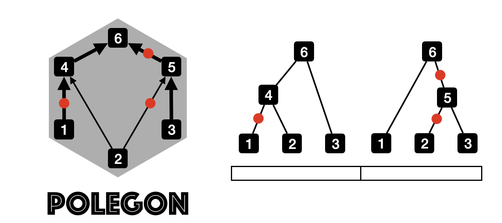

# POLEGON
POLEGON stands for **P**rior-**O**blivious **L**ength **E**stimation in **G**enealogies with **O**riented **N**etwork. POLEGON works with inferred Ancestral Recombination Graph (ARG) to re-calibrate the branch length, **without the usage of any prior**. The inferred ARGs should be in tskit format, with mutations mapped to branches. It is also important that the genealogies in the ARG should be **linked**, in that the adjacent trees should differ relatively small. After the branch length has been inferred, downstream analyses like inference of population size history can be subsequently done using the calibrated branch length.

The details of the algorithms can be found at: https://doi.org/10.1073/pnas.2504461122, which is also the citation source.

# Input and output
POLEGON takes .trees files with tskit tree sequence format (of course there need to be mutations in it!). By default it writes all posterior samples to `<output>_node_samples.txt` and the posterior mean tree sequence to `<output>.trees`.

# Basic usage
Fixated on the topology, POLEGON can generate you the posterior samples of the ARG and the posterior average of them.

The basic commands is:

```
polegon_master -m mutation_rate -input input.trees -output output_prefix -num_samples N -thin K -scaling_rep L
```

The following details to these arguments can be displayed if you simply type `polegon_master`

|flag|required?|details|
|-------------------|-----|---|
|**-input**|required|input tree sequence file (e.g. `path/to/input.trees`)|
|**-output**|required|output file prefix|
|**-m**|conditionally required|per base pair per generation mutation rate|
|**-g**|conditionally required|generation time in years. Required when `-tip_ages` is provided|
|**-mutation_map**|conditionally required|mutation rate map for the region|
|**-burn_in**|optional|the number of MCMC burn-in sweeps discarded before sampling. Default: 100|
|**-num_samples**|optional|the number of posterior ARG samples. Default: 100|
|**-thin**|optional|the number of thinning iterations in MCMC. Default: 10|
|**-scaling_rep**|optional|the number of rescaling steps after MCMC. Default: 3|
|**-max_step**|optional|maximum proposal size for root node ages in coalescent units. Default: 10|
|**-no_posterior_mean**|optional|if set, skip computing the posterior mean tree sequence. By default the posterior mean is computed from the sample log and written as the output tree sequence|
|**-tip_ages**|conditionally required|two-column file of sample ages: `tip_label  calendar_age_BP`. One row per individual. Required for heterochronous (ancient DNA) data|
|**-seed**|optional|random seed for the MCMC. Default: 42|
|**-cores**|optional|number of CPU cores for parallel MCMC. Default: 1|

If you want to use a mutation map, rather than a constant mutation rate along the genome, the mutation map file should be formatted as follows:

```
0 100000 1.2e-8
100000 200000 2e-8
200000 300000 1e-8
```

this means that the mutation rate between 0–100 kb is 1.2×10⁻⁸, and between 100–200 kb is 2×10⁻⁸. Each row specifies a genomic interval [start, end) and its per-bp per-generation mutation rate. The intervals must cover the full sequence without gaps, and the last end coordinate must be greater than or equal to the sequence length in the tree sequence file.

# Heterochronous samples (ancient DNA)
For data sets containing samples from different time points (e.g., ancient DNA), provide the sampling ages and generation time:

```
polegon_master -m mutation_rate -input input.trees -output output_prefix -tip_ages ages.txt -g 29
```

The tip ages file should have two columns: the tip label and its age in calendar years before present. One row per individual; both haplotypes of each individual are assigned that age. Tip labels must match those stored in the tree sequence. Example:

```
Sample1    0
Sample2    3500
Sample3    8000
```

# Suggestions from the developers
- The `-scaling_rep` parameter controls how many rounds of ARG rescaling are applied after MCMC. Setting it to 0 disables rescaling entirely.
- If reproducibility is required, set `-seed` to a fixed integer.
